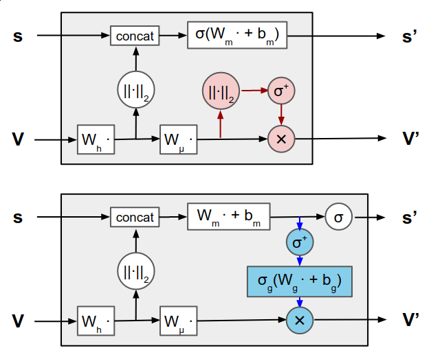

# Steerable Graph Convolutions for Learning Protein Structures
by *Synthesized Solututions*

## Introduction
<!-- An analysis of the paper and its key components. Think about it as nicely formatted review as you would see on OpenReview.net -->
Machine learning is increasingly being applied to the analysis of molecules for tasks such as protein design, model quality assessment, and ablation studies. These techniques can help us better understand the structure and function of proteins, which is useful for many medical application, such as drug discovery. Convolutional Neural Networks (CNNs) and Graph Neural Networks (GNNs) are two types of machine learning models that are  particularly well-suited for analyzing molecular data. CNNs can operate directly on the geometry of a structure and GNNs are expressive in terms of relational reasoning.

However, proteins are complex biomolecules with a unique three-dimensional structure that is critical to their function and modeling the interactions between non-adjacent amino acids can be challenging. Both CNNs and GNNs might be translation invariant and equivariant (right?), but this is not the case for rotations.  Formally we can define equivariance as follows:

$$f(g\cdot x) = g\cdot f(x)$$

In order to keep more geometric information, Jing, Eismann, Suriana, Townshend, and Dror (2020) propose a method that combines the strengths of CNNs and GNNs to learn from biomolecular structures. Instead of encoding 3D geometry of proteins, i.e. vector features, in terms of rotation-invariant scalars, they propose that vector features be directly represented as geometric vectors in 3D space at all steps of graph propagation. They claim that this approach would improve the GNN's ability to reason geometrically and capture the spatial relationships between atoms and residues in a protein structure. 

This modification to the standard GNN consists of changing the multilayer perceptrons (MLPs) with geometric vector perceptrons (GVPs). The GVP approach described in the paper is used to learn the relationship between protein sequences and their structures. GVPs are a type of layer that operates on geometric objects, such as vectors and matrices, rather than on scalar values like most neural networks. This makes GVPs well-suited to tasks that involve analyzing spatial relationships, which is highly important for protein structures. 

In GVP-GNNs, node and edge embeddings are represented as tuples of scalar features and geometric vector features. The message and update functions are parameterized by geometric vector perceptrons, which are modules that map between the tuple representations while preserving rotational invariance. In a paper by Jing, Eismann, Soni, and Dror (2021) they extended the GVP-GNN architecture to handle atomic-level structure representations, which allows the architecture to be used for a wider range of tasks. <!-- why, idk rn -->

In the original GVP-GNN architecture, the vector outputs are functions of the vector inputs, but not the scalar inputs, which can be an issue for atomic-level structure graphs where individual atoms may not necessarily have an orientation. <!-- also don't really understand why -->
To address this issue, they propose vector gating as a way to propagate information from the scalar channels into the vector channels. This involves transforming the scalar features and passing them through a sigmoid activation function to "gate" the vector output, replacing the vector nonlinearity. In the paper they note that because the scalar features are invariant and the gating is row-wise, the equivariance of the vector features is not affected. They conclude that vector gating can help improve the GVP-GNN's ability to handle atomic-level structure representations and therefore machine learning on molecules.

<!-- add a better conclusion of this paragraph here -->

<!-- Equivariant message-passing seeks to incorporate the equivariant representations of ENNs within the message-passing framework of GNNs instead of indirectly encoding the 3D geometry in terms of pairwise distances, angles, and other scalar features. <----- this is a sentence from the 2021 paper -->

    

    <em>Figure 1.</em> Schematic of the original geometric vector perceptron (GVP) as described in Jing et al. (2020) (top) and the modified GVP presented in Jing et al. 2021 (bottom). The original vector nonlinearity (in red) has been replaced with vector gating (in blue), allowing information to propagate from the scalar channels to the vector channels. Circles denote row- or element-wise operations. The modified GVP is the core module in the equivariant GNN.

## Strengths and Points of Improvement
<!-- Exposition of its weaknesses/strengths/potential which triggered your group to come with a response. -->

<!-- #BEGIN NOTES#

- Current model is not very expressive, but quite efficient; it's not steerable (slow); can only handle type-1
  - GVPs would kind of be part of the Invariant Message Passing NNs
  - So I consider it as a “incomplete” steerable mlp
  - My point is that steerable MLP can enable the information exchange between all possible pairs of vectors (type 0, 1, …, n), but GVP can only exchange the information from scalar vector to type-1 vector by using gating and from type-1 vector to scalar using norm.
- only invariant to rotation, due to taking norm (scalar value) (i think) -> this is only the case in the 2020 paper, but not necessarily in the 2021 paper, so i think we really need to focus on the expressiveness and not necessarily the equivariance

#END NOTES# -->

The current model of the authors manages to combine the strengths of CNNs and GNNs while maintaining the rotation invariance whilst using a model is not very computationally demanding. The invariance for rotation is essential because the orientation of the molecule does not change the characteristics of the molecule. However, the combination of the molecules into a protein does depend on the orientation of (the linkage between) the molecules, e.g. the shape of the protein does affect the characteristics of the protein. This is a weakness in the otherwise strength of the model. In the follow-up paper, they introduced the vector-gating to retain the rotational equivariance of the vector features, but this version of the GVP can only exchange information from scalar vectors to type-1 vectors and vice versa, using the norm. <!-- This last sentence is what Cong said, but I still don't really understand it. -->
This triggered us to figure out an approach to take away the weak point while maintaining the strength. 

## Our Contribution
<!-- Describe your novel contribution. -->

<!-- based on Noa's hidden stuff :) -->
We aim to achieve this the GVP (steerable) rotation equivariant instead of invariant whilst being able to work with any type-$k$ vectors. As a result, the model remains invariant for the orientation of the molecule, while it takes the orientation of the molecule into account for building the protein and thus the structure of the protein as a whole. The equivariance makes the model treat a protein with all molecules in a line and a protein with all molecules bundles in a small boll, be represented differently instead of similar like the original model. 

- Explain about steerable graph convolutions :)
- 

<!-- - changing perhaps change the k in knn for these graph convolution (message passing layers) -->

<!-- 
ChatGPT stuff on the explanation of steerable graph convolutions
In a steerable graph convolution, the filters are defined in a way that they can be rotated to any direction in the graph, by using a steering matrix. The steering matrix is a set of complex-valued coefficients that are learned during training, and it encodes the rotation of the filters in the spectral domain of the graph Laplacian matrix.

The spectral domain of the graph Laplacian matrix consists of its eigenvalues and eigenvectors. The eigenvectors represent the basis functions of the graph, while the eigenvalues correspond to the frequencies of the functions. By multiplying the filter with the steering matrix in the spectral domain, the filter is rotated to the desired direction in the graph.

The steerable graph convolutional operation can be represented as:

$Y = U g(\Lambda) U^T X$,

where $X$ is the input feature matrix, $Y$ is the output feature matrix, $U$ is the matrix of eigenvectors of the graph Laplacian, $\Lambda$ is the diagonal matrix of eigenvalues, $g$ is a diagonal matrix of learnable filter coefficients, and $T$ denotes matrix transpose.

The steerable graph convolution can be efficiently implemented using the Chebyshev polynomial approximation, which allows for a low-order polynomial approximation of the filter function in the spectral domain. This reduces the computational complexity of the operation and makes it practical for large-scale graphs.

Overall, steerable graph convolutions offer a flexible and efficient way to perform graph convolutional operations in any direction, making them suitable for a wide range of graph-based machine learning tasks.
 -->

## Conclusion
<!-- Conclude -->

## Contributions
<!-- Close the notebook with a description of each student's contribution. -->
